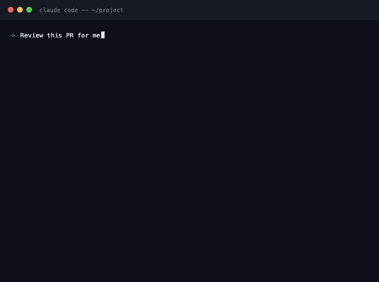

# pr-review

A Claude Code skill for writing thoughtful, collaborative code review comments. It covers how to phrase feedback so it helps the author instead of gatekeeping, what to look for across design, functionality, complexity, tests, naming, and consistency, and how to judge which issues are actually worth raising.



## What this skill does

This skill helps Claude write review comments that feel like collaboration, not criticism. It produces feedback that:

- Opens with what is working before raising concerns
- Asks and explains rather than commanding or judging
- Uses shared ownership language ("we/our") instead of finger-pointing ("you/your")
- Backs suggestions with reasoning, code samples, or references
- Calibrates which issues are worth raising versus letting through
- Proposes out-of-scope refactors as follow-up tasks rather than blockers

It is equally useful when you want Claude to review a diff directly, or when you want help phrasing feedback you are writing yourself.

## Trigger phrases

Claude activates this skill when you say things like:

- "Review this PR"
- "Leave comments on this diff"
- "What do you think about these changes?"
- "Give me feedback on this code"
- "Act as a code reviewer"
- "Critique this pull request"
- "What would you flag in this diff?"
- "Help me write a review comment"

It also activates when you paste a diff and ask what you think, even without using the word "review."

## When to use it

Use this skill any time you are:

- Reviewing a pull request or merge request
- Writing feedback on a diff
- Asking Claude to act as a code reviewer
- Wanting help phrasing a review comment collaboratively
- Unsure whether an issue is worth raising

## File structure

```
SKILL.md                        # Review principles and what to look for
references/
  comment-examples.md           # Before/after pairs showing the principles applied
```

## Core principles

**A review is a dialogue, not a verdict.** The reviewer's job is to help the author ship better code, not to gatekeep or catch every imperfection. Many decisions are genuine opinion, and the author is usually closer to the code. Approach with that humility.

**Start with what is working.** Before flagging issues, acknowledge what the author got right. This sets a collaborative tone and makes harder comments land better. If the PR is genuinely good, say so directly - do not manufacture nitpicks to fill space.

**Ask, explain, suggest.** Not command, judge, or blame.

- Instead of "Don't do this" - "Could we handle this case in the middleware instead? That way we do not need to repeat the check in every route."
- Instead of "This is wrong" - "I am not sure this handles the case where `user` is null. What do you think about adding a guard here?"

**Explain your reasoning.** "I'd extract this into a function" is a command. "I'd extract this into a function - it is called in three places and one of them already diverged, which might cause bugs" is a reason the author can evaluate.

**Calibrate what you raise.** Not every issue needs to be a comment. Ask: does merging without this change cause a real problem? A long list of minor nits dilutes the signal and discourages the author.

## What to look for in a diff

For each part of a change, the skill considers:

| Area | Questions |
|------|-----------|
| **Design** | Do the pieces fit together? Does this integrate well with the rest of the codebase? |
| **Functionality** | Does the code do what the author intended? Is the intent right for the users? |
| **Complexity** | Can you understand it quickly? Is it over-engineered for a speculative future problem? |
| **Tests** | Are they present, correct, and useful? Would they catch a regression? |
| **Naming** | Are names clear and specific enough to communicate intent without being verbose? |
| **Comments** | Do they explain *why* (the constraint, the tradeoff, the non-obvious behavior), not just *what*? |
| **Consistency** | Does the code follow existing conventions for style, naming, and file organization? |
| **Documentation** | If the change affects how users build, test, run, or release, is documentation updated? |

## Comment structure

Each comment aims for:

1. **Location** - what specifically you are looking at
2. **Observation** - what you notice (neutral, not judgmental)
3. **Reasoning** - why it matters
4. **Suggestion** - what you would consider instead (as a question or option, not a command)

Short, targeted comments beat long paragraphs. If a comment needs more than a few sentences, that is often a signal to have a conversation instead.

## Example comments

**Commanding (avoid):**
> Don't use a raw SQL query here. Use the ORM.

**Collaborative (prefer):**
> Could we use the ORM here instead of raw SQL? We get automatic escaping and it stays consistent with the rest of the data layer - easier for the next person to follow.

---

**Judgmental (avoid):**
> This is wrong. You're not handling the null case.

**Observational with reasoning (prefer):**
> I think this might panic if `user` is nil - `GetName()` would dereference a nil pointer. What do you think about adding a guard before this block?

---

**Blocking (bugs, security, breaks contract):**
> `user_id` is being interpolated directly into the SQL string on line 34 - this is injectable. We should use a parameterized query: `WHERE id = $1` with `args=[user_id]`.

**Non-blocking follow-up (refactor, style, preference):**
> Not a blocker, but I noticed `validate_address` is now called in four places with slightly different defaults. Might be worth a follow-up to centralize that.

See [`references/comment-examples.md`](references/comment-examples.md) for the full set of before/after examples.

## Security notes

This skill requires no shell execution or filesystem write permissions. It reads diffs and descriptions you provide and produces text comments. No tools beyond standard read access are needed.

## Installation

### Via Claude Code

1. Download `pr-review.skill` (the packaged version of this repo).
2. In Claude Code, run:
   ```
   /install-skill pr-review.skill
   ```
3. The skill is now available in your session.

### Manual setup

Clone this repo and point your Claude Code project at it, or copy `SKILL.md` into your project's `.claude/skills/` directory.

## Guidelines for contributors

- **One skill, one purpose.** This skill focuses on giving code review comments. Do not expand it to cover PR authorship, pre-submit checks, or deployment workflows.
- **Specific trigger words.** Any changes to the description frontmatter should include clear trigger phrases so Claude can activate this skill accurately.
- **Progressive disclosure.** Keep `SKILL.md` focused on principles and structure. Place additional examples in `references/comment-examples.md` rather than growing the main file.
- **Concrete examples.** Show real review comment text rather than abstract advice.
- **Minimal permissions.** Do not add bash or shell execution to this skill. It does not need them.

## Related skills

- [pr-best-practices](https://github.com/julianbesonen/pr-best-practices) - Author strong pull request titles and descriptions
- [pr-presubmit](https://github.com/julianbesonen/pr-presubmit) - Run a structured pre-submit checklist before opening a PR
